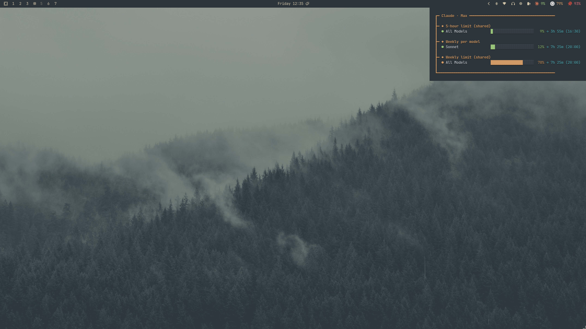

<h1 align="center">Agent Bar</h1>

<p align="center">
  
</p>

Waybar modules for watching agent CLI usage limits: remaining quota, used quota,
reset windows, and login/error state.

Supported providers:

- Claude Code
- OpenAI Codex
- GitHub Copilot
- Amp

## Install

Requires Bun.

```bash
cd /tmp && bun add -g @noctuacore/agent-bar && agent-bar setup
```

> Run the command from `/tmp` (or any non-`$HOME` dir) and keep the `-g` flag.
> Without `-g`, `bun add` treats the current directory as a project and writes
> `package.json` + `bun.lock` there. If that happened, run
> `agent-bar doctor` to clean up.

`setup` installs the Waybar modules, CSS, provider icons, terminal helper, and
`~/.local/bin/agent-bar` symlink.

To update later, run:

```bash
agent-bar update
```

For development, use a normal checkout:

```bash
git clone git@github.com:othavioquiliao/agent-bar.git
cd agent-bar
bun install
bun run start status
```

## Commands

```bash
agent-bar             # Waybar JSON
agent-bar status      # Terminal quota view
agent-bar menu        # Login and layout TUI
agent-bar update      # Update the install (npm package or managed checkout)
agent-bar setup       # Re-apply Waybar integration
agent-bar uninstall   # Interactive removal
agent-bar remove      # Forced removal
agent-bar doctor      # Detect & clean leftovers in $HOME
```

`agent-bar update` detects the install type. For an npm/Bun global install it
updates the package; for the legacy managed `~/.agent-bar` checkout it fetches
and resets to upstream. In a development checkout it refuses and tells you to
use git.

## Docs

- [Docs index](docs/README.md)
- [Commands](docs/commands.md)
- [Runtime](docs/runtime.md)
- [Waybar integration](docs/integration.md)
- [Waybar contract](docs/waybar-contract.md)
- [Troubleshooting](docs/troubleshooting.md)
- [New provider guide](docs/new-provider.md)
